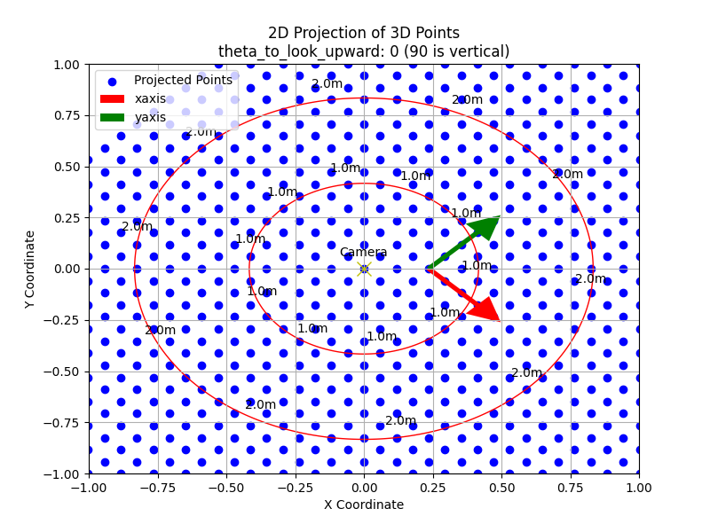
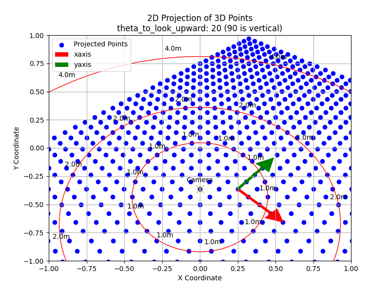
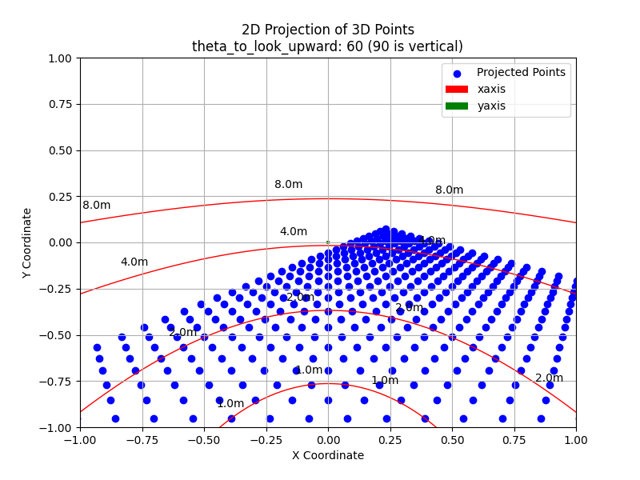

# Camera-Pattern-Playground

A sandbox for exploring and validating simple pattern-based methods to infer scene or camera information.

## Environment setting

```bash
conda create -n campat python=3.11
conda activate campat
pip install numpy
pip install opencv-python
pip install matplotlib
pip install ipython
```

## Use homography to calculate the distance to the camera

- [x] Camera Projection
- [x] gen_camorigin_proj implementation
- [x] Distance Calculation
- [ ] Noise in homography estimation

```bash
python test_homography_dist.py
```

### Some sample results

* The base of the camera pole is at the center of the image.


* The base of the camera pole is near the edge of the image.


* The base of the camera pole is outside of the image frame.
